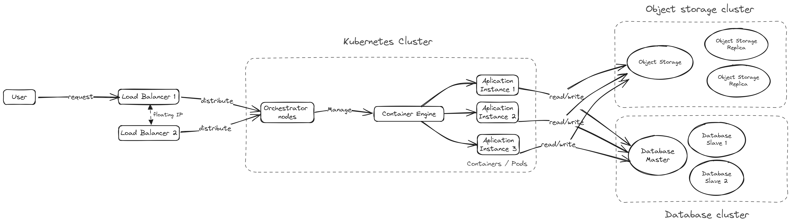

<p align="center"><a href="https://laravel.com" target="_blank"></a></p>


<h1 align="center">ArvanCloud Challenge</h1>
<br><br>


## Install Dependencies

```
composer install
```


## Setup With Docker

```
./vendor/bin/sail up -d
```

```
./vendor/bin/sail artisan migrate
```
```
./vendor/bin/sail artisan module:seed
```


## Setup With Laravel Serve

```
php artisan serve
```

```
php artisan migrate
```
```
php artisan module:seed
```


## Project Structure (Modular):
```
Modules
└── DataProcessor
    ├── app
    │   ├── Http
    │   │   ├── Controllers
    │   │   │   └── DataProcessorController.php
    │   │   ├── Middleware
    │   │   │   └── QuotaMiddleware.php
    │   │   └── Requests
    │   │       └── ProcessDataRequest.php
    │   ├── Models
    │   │   ├── ProcessHistory.php
    │   │   └── Quota.php
    │   ├── Providers
    │   │   ├── DataProcessorServiceProvider.php
    │   │   └── RouteServiceProvider.php
    │   └── Rules
    │       └── NoRecentProcessRule.php
    ├── config
    │   └── config.php
    ├── database
    │   ├── factories
    │   │   ├── ProcessHistoryFactory.php
    │   │   └── QuotaFactory.php
    │   ├── migrations
    │   │   ├── 2023_12_01_140255_create_process_histories_table.php
    │   │   └── 2023_12_01_140311_create_quotas_table.php
    │   └── seeders
    │       └── DataProcessorDatabaseSeeder.php
    ├── routes
    │   └── api.php
    ├── tests
    │    └── Feature
    │       ├── DataProcessorControllerTest.php
    │       ├── NoRecentProcessRuleTest.php
    │       ├── QuotaMiddlewareTest.php
    │       └── RequestRateLimiterTest.php
    ├── module.json
    └── composer.json

18 directories, 21 files
```


## TDD Results:
```angular2html

   PASS  Modules\DataProcessor\tests\Feature\DataProcessorControllerTest
  ✓ passes validation when no recent process exists                                                                                                             1.18s  

   PASS  Modules\DataProcessor\tests\Feature\NoRecentProcessRuleTest
  ✓ passes validation when no recent process exists                                                                                                             0.04s  
  ✓ passes validation has process exists                                                                                                                        0.06s  

   PASS  Modules\DataProcessor\tests\Feature\QuotaMiddlewareTest
  ✓ quota exceeded                                                                                                                                              0.03s  
  ✓ quota not exceeded                                                                                                                                          0.03s  

   PASS  Modules\DataProcessor\tests\Feature\RequestRateLimiterTest
  ✓ rate limiter                                                                                                                                                0.03s  

  Tests:    6 passed (8 assertions)
  Duration: 1.56s
```

## Postman:
You can import the postman_collection.json file that is in the root folder to the Postman application.

## A Visual Exploration of Software Section Interactions:
In this diagram, the logic of the program and the interaction between the various components, including system input, queue, and object storage, are depicted using a flowchart.


## System Design:
The system design depicted encapsulates key elements and relationships within the software system, offering a comprehensive overview. It serves as a valuable reference point for understanding the overall structure and interconnections of the components.



## Request Life Cycle Details:
The depicted diagram shows the request cycle. Various stages of the request, along with distinct task sections. This comprehensive diagram aids in understanding the flow of requests through Laravel, offering insights into the different request-handling processes and their interconnected functionalities. Developers can refer to this visual representation for a holistic view of the software's internal workings, facilitating comprehension and navigation within the Laravel framework.


